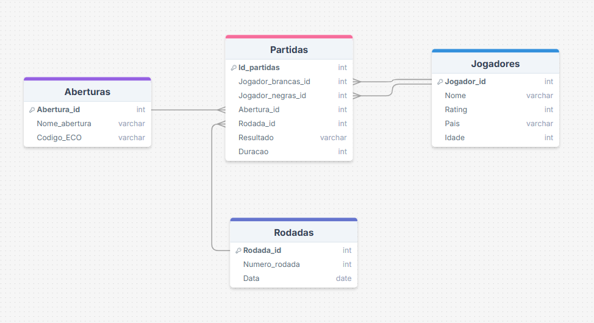

# 📊 Modelagem de Dados (SQL) - Torneio de Xadrez

Este repositório tem como objetivo apresentar a modelagem e a criação de um banco de dados para um torneio de xadrez, utilizando SQL. 
Além da estrutura do banco de dados, o projeto inclui a população das tabelas com dados fictícios, permitindo análises como número de vitórias por jogador, 
taxa de sucesso das aberturas e estatísticas de duração das partidas.

---

## 📂 Estrutura do Projeto

- criacao-e-populacao-de-tabelas/
    - criar_tabelas.sql
    - popular_tabelas.sql
- Diagrama-Modelo-logico.png
- consultas-para-analise.sql
- README.md

---

## 🗄️ Modelagem de Dados

As seguintes entidades estão presentes neste modelo relacional: 

- **Jogadores** (`jogadores`) → Representa os participantes do torneio de xadrez.
- **Aberturas** (`aberturas`) → Contém informações sobre as aberturas usadas nas partidas.
- **Rodadas** (`rodadas`) → Representa cada rodada do torneio.
- **Partidas** (`partidas`) → Tabela fato que registra os confrontos entre os jogadores.

As tabelas foram relacionadas através de chaves estrangeiras, preservando a integridade referencial do banco de dados.

